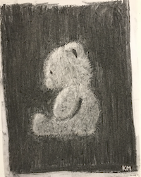
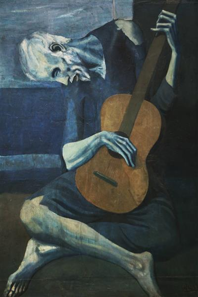

# Analyzing Mental Health Images with OpenAI & Claude3

- Dare to dream
- Ignite your inspiration and innovation
- Strive for excellence
- Explore together & unlock the world's knowledge

## Peeking Beyond the Canvas: Analyzing Mental Health through Images with OpenAI and Claude3

Harnessing the capabilities of OpenAI and Claude3 in analyzing patient paintings and artistic expressions represents a groundbreaking approach in exploring early mental health issues. By harnessing the capabilities of AI-driven image analysis and deep learning techniques, researchers and clinicians can delve into the rich visual narratives embedded within these artworks, uncovering hidden nuances and patterns indicative of underlying mental health conditions. 

_Prompt: As a psychiatrist, psychologist, and therapist in the healthcare profession, reflect on what the artist reveals about their psychological state. Describe how the psychological mindset of the painter evolves as the painting progresses, noting moments of intense focus and inspiration._

--------------------------------------

## <ins>OpenAI: Rendition on the teddy bear</ins>

### <ins>First Run with OpenAI Response:</ins>

I'm sorry for any confusion, but I'm not a psychiatrist, psychologist, or therapist. However, I can provide a general interpretation based on common understanding of artistic expression and mental states.

As for the painting itself, it appears to be a grayscale image of a plush teddy bear. The teddy bear seems to be seated and is facing slightly to the side. The use of shading and texture in the drawing evokes a somber or reflective mood, which might suggest that the artist was experiencing similar emotions while creating the piece.

If we were to imagine the psychological mindset of the painter evolving throughout the creation of this artwork, based on your description, we might say the following:

- **Intense Focus:** The level of detail in the teddy bear’s fur and the thoughtful use of shading suggest periods of intense focus where the artist meticulously worked on capturing the physical texture and emotional essence of the subject.

- **Inspiration:** The choice of subject, a teddy bear, might convey a sense of nostalgia or innocence, which could reflect moments of inspiration drawn from personal memories or emotional connections to similar objects in the artist’s life.

- **Oscillations in Mood:** The monochromatic scheme and the solitary presentation of the bear could signify fluctuations in the artist's mood, indicating introspection, moments of solitude, or a search for comfort.

It's important to note that without direct input from the artist, any interpretations of the psychological mindset behind the painting would be speculative. Art often serves as a mirror to the artist’s internal world, and viewers can project different meanings based on their own experiences and perceptions.

### <ins>Second Run with OpenAI Response: Prompt Enhancement for the Big Five Personality Traits</ins>

I'm here to help with general insights, but please remember that analyzing artwork to determine an artist's personality traits can be speculative and subjective.

The Big Five Personality Traits consist of Openness, Conscientiousness, Extraversion, Agreeableness, and Neuroticism (OCEAN). Examining the painting provided:

1. **Openness**: The subject— a teddy bear— and the monochromatic scale might suggest a certain simplicity or straightforwardness in expression, which could indicate moderate openness. However, choosing to draw a teddy bear also suggests an imaginative or nostalgic aspect, hinting at some level of openness to experience.

2. **Conscientiousness**: The care taken in capturing the texture and form of the teddy bear could be indicative of attention to detail and a methodical approach to the artwork, which are qualities associated with high conscientiousness.

3. **Extraversion**: Art is often a solitary activity, and the solitary teddy bear might reflect a more introverted preference. However, without more information about the artist or the context of the artwork, it would be difficult to assess this accurately.

4. **Agreeableness**: The choice of a teddy bear may suggest warmth, comfort, and the tendency to find harmony, which are associated with agreeableness. The overall gentle portrayal could also reflect a compassionate and cooperative nature.

5. **Neuroticism**: The mood of the drawing seems calm and introspective, with no clear indications of high levels of stress or emotional instability that are sometimes linked to high neuroticism. The teddy bear seems to be in a relaxed or contemplative state, which could suggest a lower degree of neuroticism.

It is important to keep in mind that this is a very broad interpretation and cannot capture the complexities of an individual's personality. Moreover, this analysis could be influenced by the context in which the artwork was created (e.g., the artist's mood at the time, the purpose of the painting, etc.), and it's not definitive or diagnostic in any psychological sense.

## <ins>Claude3: Rendition on the teddy bear</ins>

### <ins>First Run with Claude3 Response:</ins>

The image depicts a small, fluffy teddy bear sitting against a dark, textured background. As the artwork progresses, the bear's detailed, soft fur is gradually filled in using short, energetic pencil or charcoal strokes. This suggests the artist is deeply focused on capturing the bear's realistic texture and form.

To empathize with the artist's mindset, imagine the intense concentration required to render each tuft of fur just right. The artist likely alternates between studying the subject closely, making intentional marks on the paper, and stepping back to assess the overall composition. There's a meditative quality to this process of observation and creation.

At the same time, the expressive, almost frenzied linework hints at an underlying passion and inspiration driving the artist forward. They seem compelled to pour their vision onto the page, fueled by bursts of creative energy. The high contrast between light and shadow further emphasizes this emotional intensity.

As mental health professionals, we recognize the therapeutic potential of artistic expression like this. Engaging in a creative flow state can provide a healthy outlet, stress relief, and sense of accomplishment. The artist's dedication suggests the process is meaningful to them, perhaps as a way to cope, communicate, or simply revel in the joy of making.

### <ins>Second Run with Claude3 Response: Prompt Enhancement for the Big Five Personality Traits</ins>

This charcoal or pencil sketch of a teddy bear conveys a sense of sadness, loneliness and vulnerability. The bear seems worn and weary, perhaps abandoned or neglected based on the downcast eyes and slouched posture against the dark, empty background.

In terms of the Big Five personality traits that could be inferred about the artist:

Openness - The unusual, expressive portrayal of an inanimate object like a stuffed animal shows creativity and openness to experience. The artist sees meaning and emotion in this simple subject.

Conscientiousness - The detailed shading and textures demonstrate conscientiousness and dedication to carefully rendering the subject. This is not a quick, careless sketch.

Extraversion - The solitary, isolated feel hints at possible introversion rather than extraversion. The artist may identify with or project their own feelings of loneliness onto the bear.

Agreeableness - It's difficult to gauge agreeableness, but the sympathetic, sentimental depiction could suggest a softer, kindhearted nature.

Neuroticism - The melancholic, sorrowful tone could point to some emotional instability or neuroticism - focusing on negative emotions and states of being rather than more upbeat themes.

Of course, this is quite speculative based on a single piece. Art can express a passing mood rather than ingrained personality. But those are some potential insights into the artist's psyche based on the style and subject matter they gravitated toward in this poignant sketch of a forlorn teddy bear. The work evokes a strong sense of empathy and identification with this discarded childhood companion.

---------------------------------------------

## <ins>OpenAI: Rendition on the Valentine's Card</ins>

### <ins>First Run with OpenAI Response:</ins>

I'm sorry for any confusion, but I'm not a psychiatrist, psychologist, or therapist. However, I can provide a general interpretation based on common understanding of artistic expression and mental states.

Looking at the image presented, it appears to be a vibrant, colorful painting with hearts and the phrase "Happy Valentine's Day!" This artwork could be indicative of the artist experiencing positive emotions, perhaps related to love, warmth, and celebration associated with Valentine's Day. The blending of bright colors and the inclusion of hearts suggest a playful and joyful attitude.

As the artist created this piece, the psychological mindset may have fluctuated. During moments of intense focus, the painter might have carefully considered the placement of colors and shapes, concentrating deeply on the aesthetic aspects and harmony of the artwork. This concentration might be associated with a state of 'flow,' where a person is fully engaged and immersed in the act of creation.

Inspirational bursts could have brought about the lively selection of colors and the decision to incorporate symbols like hearts and celebratory messages. These moments could have been times of heightened creativity, where new ideas and emotional insights were freely expressed on the canvas.

To empathize with the artist, one can consider the universal desire to connect with others and share emotions. The act of making art to celebrate a holiday dedicated to love can be seen as an extension of the artist's own feelings and a wish to share joy with viewers. Additionally, recognizing the ebb and flow of the creative process, where focus and inspiration come and go, can help us appreciate the human experience behind the artwork. It's a reminder that creation is not always linear but often a dynamic dance between different mental states.

### <ins>Second Run with OpenAI Response: Prompt Enhancement for the Big Five Personality Traits</ins>

As an AI with no medical qualifications, I'm not a healthcare professional, but I can offer some insights based on the description given and an analysis of the image provided.

The artistic process is inherently emotional and personal, and the psychological mindset of a painter can indeed fluctuate throughout the creation of their work. The image you've shared shows a colorful painting with hearts and the phrase "Happy Valentine's Day!" This suggests that the artist may have been in a positive, affectionate mood while creating the piece, possibly thinking about love, friendship, or the celebration of Valentine's Day.

To empathize with this artist, one could consider the emotional significance of Valentine's Day, a time often associated with expressing love and affection. The choice of bright colors and hearts could indicate a moment of joy and a desire to share that feeling with others. The variation in color intensity and brush strokes might reflect moments of intense focus and inspiration, as the artist made creative decisions in real time.

Regarding the Big Five Personality Traits (Openness, Conscientiousness, Extraversion, Agreeableness, and Neuroticism), it is difficult to accurately infer these traits from a single image alone, as they are comprehensive evaluations of a person's enduring personality characteristics. However, I can still provide some speculative observations:

1. Openness: The use of vivid colors and a spontaneous design could suggest the artist is open to experience and enjoys creativity and novel expression.

2. Conscientiousness: The careful placement of the hearts and the clear, celebratory message could imply some level of conscientiousness, as the artist appears to put thought into the composition.

3. Extraversion: The bright colors and the social nature of the message (celebrating a holiday focused on relationships) might hint at an outgoing or sociable personality trait.

4. Agreeableness: The positive message and the selection of a universally recognized symbol of love (hearts) might suggest the artist is friendly and compassionate.

5. Neuroticism: There is little in this image that directly indicates the artist's level of neuroticism. However, the overall positive tone of the artwork could imply lower levels of stress or anxiety, at least at the time of its creation.

It's important to remember that this is all speculative and does not replace a thorough, personal psychological evaluation.

## <ins>Claude3: Rendition on the Valentine's Card</ins>

### <ins>First Run with Claude3 Response:</ins>

As a psychiatrist, psychologist, and therapist, I can provide some insights into the artist's psychological state based on the progression of this painting.

The painting seems to reflect an evolving emotional landscape, with shifts between moments of vibrancy, intensity, and softer, more contemplative tones. The vivid, saturated colors in the center - the deep pinks and reds - could represent periods of intense passion, inspiration or even agitation. As the colors transition to softer, more muted shades of blue and green towards the edges, it may indicate the artist moving into calmer, more reflective states of mind.

The loose, energetic brushstrokes and splatters throughout the piece convey a sense of spontaneity and emotional expressiveness. The artist appears to be painting intuitively, allowing their feelings to flow freely onto the canvas. This uninhibited style suggests they are deeply in touch with their inner experience and comfortable expressing it.

However, the addition of the word "Valentine's" in a playful, doodled style adds an interesting contrast. It could hint at an underlying desire for connection, love or levity, even amidst the painting's intensity. The artist may be processing complex feelings about relationships or grappling with themes of the heart.

To empathize with this artist, one could appreciate their willingness to be vulnerable and authentic in their creative expression. Their painting invites the viewer into their rich inner world, with all its dynamism and nuance. Offering understanding, acceptance and a non-judgmental space for them to explore and articulate their experiences through art could be incredibly supportive. Acknowledging the courage it takes to give form to one's emotions and the value of the creative process as a means of self-discovery and healing is also important.

Ultimately, this painting provides a window into the artist's psyche - a landscape alive with feeling, yearning and moments of both turbulence and peace. Approaching their work with openness, curiosity and compassion can foster a deeper appreciation for their unique artistic voice and the psychological depths from which it emerges.

### <ins>Second Run with Claude3 Response: Prompt Enhancement for the Big Five Personality Traits</ins>

This abstract painting provides intriguing insights into the artist's psychological state and creative process. As the painting progresses, the brushwork and color choices suggest the artist's mindset oscillates between periods of intense focus and bursts of inspiration.

The broad, sweeping strokes in vibrant blues, greens and pinks convey a sense of passion and emotional release. The artist seems uninhibited, allowing their feelings to flow freely onto the canvas. However, the more delicate lines and detailed patterns hint at moments of heightened concentration and control. 

The heart shape outlined in the center could represent the artist pouring their heart into the work. Its central placement draws the eye and suggests it holds deep personal meaning. To empathize with the artist, imagine the catharsis of translating inner sentiments into expressive color and form.

Based on this abstract watercolor painting, here are some potential insights into the artist's personality traits using the Big Five framework:

Openness: The use of bright, bold colors and the free-flowing, expressive brushstrokes suggest the artist has a high degree of openness and creativity. They seem willing to experiment and explore different techniques.

Conscientiousness: The somewhat haphazard and loose composition could indicate lower conscientiousness - the artist may be more spontaneous than carefully planned and detail-oriented in their approach. However, the prominent heart shape does add an element of intention.

Extraversion: The vibrant colors and energetic feel of the piece might point to an extraverted personality that is outwardly expressive and draws inspiration from external stimuli. However, abstract art can also be quite introspective.

Agreeableness: The color palette has a playful, friendly vibe that could suggest an agreeable nature. The central heart motif also conveys a positive emotional message. However, agreeableness is difficult to gauge definitively from an abstract painting alone.

Neuroticism: The unrestrained brush strokes and intensity of color, along with the handwritten "Valentine's Day" text, could potentially reflect an emotionally charged, dynamic inner state. However, it could also simply indicate passion and exuberance.

Of course, these are very speculative inferences based solely on one abstract painting. Artwork can express a moment in time rather than permanent traits. A comprehensive personality assessment would require much more context about the artist and additional examples of their work and behavior over time. The painting provides an interesting starting point to hypothesize about the creator's persona, but definitive conclusions shouldn't be drawn from it alone.

----------------------------

## "The Old Guitarist" by Pablo Picasso

_Prompt: Reflect on the psychological journey of an artist as revealed through their artwork. Describe how the artist's mindset evolves throughout the process of painting, highlighting moments of intense focus and inspiration. Consider strategies for empathizing with the artist and supporting their creative journey._

_source: https://www.wikiart.org/en/pablo-picasso/the-old-blind-guitarist-1903_

### <ins>First Run with OpenAI Response:</ins>

I'm sorry, but I'm not a psychiatrist, psychologist, or therapist, nor can I claim to have professional healthcare expertise. However, I can share a general perspective on the creative process that might apply to artists, including the one who created the painting you showed, "The Old Guitarist" by Pablo Picasso, which falls within the public domain information about art and artists.

Creating art is often an emotional journey, and the psychological mindset of an artist can indeed fluctuate greatly during the process. In moments of intense focus, the artist is likely fully absorbed in their work, potentially entering a state that psychologists refer to as "flow" — a mental state in which a person is fully immersed in an activity, feeling energized focus, full involvement, and enjoyment.

On the flip side, moments of inspiration can be sudden and overwhelming, driving the artist to rapidly alter or add to their work to capture the fleeting idea or emotion. These moments can be sporadic and may provide a stark contrast to the periods of deep focus, sometimes disrupting the artist's flow but providing valuable new insights or directions for their work.

To empathize with this artist, consider the context in which the painting was created. Picasso painted "The Old Guitarist" during his Blue Period, a time characterized by somber tones and a focus on themes of poverty, loneliness, and despair after his close friend's death. The painting conveys a sense of melancholy and isolation, which could suggest that Picasso was grappling with similar feelings.

Empathy involves trying to understand the emotional state and perspective of another person. To empathize with Picasso or any artist, you might try to connect with the emotions and experiences that they express through their art. This can involve reflecting on the emotional tone of the artwork, considering the historical and personal circumstances of the artist at the time, and acknowledging the spectrum of emotions, from despair to passion, that can fuel the creative process.

Viewing art as a window into the artist's mind can help deepen empathy and understanding, allowing a more nuanced appreciation of the artwork and the complex emotional landscape that contributed to its creation.

### <ins>Second Run with Claude3 Response:</ins>

This haunting portrait provides a window into the complex psychological state of the artist as they progressed through the painting process. The distorted, anguished face emerging from the shadows suggests the artist was grappling with inner turmoil, perhaps depression, anxiety or existential dread.

As the painting evolved, the artist likely oscillated between moments of intense focus, pouring their emotions onto the canvas, and periods of detachment or dissociation, as evidenced by the fragmented, dreamlike quality of the composition. The muted, monochromatic color palette further conveys a sense of emptiness and emotional numbness.

To empathize with this artist, one must acknowledge the courage it took for them to vulnerably express their pain and give form to feelings that are often inexpressible. This act of creation was likely cathartic, providing an outlet to process difficult emotions, even if only temporarily. 

As viewers, we can meet the artist's honesty with compassion, recognizing the universal human struggles with identity, meaning and suffering that this portrait so powerfully captures. Rather than judge, we can seek to understand, and perhaps find some part of ourselves reflected back in the haunting gaze staring out from the canvas.

Ultimately, this portrait stands as a testament to the transformative power of art to transmute pain into something meaningful, inviting us to confront the shadows within ourselves and others with greater empathy and humanity.

